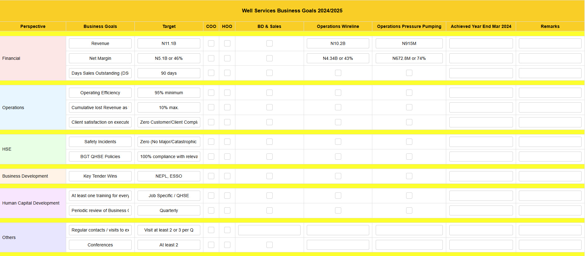

# KPI SHEET 📊🏗️  

This project showcases **a professional and dynamic Key Performance Indicator (KPI) sheet,** tailored for monitoring and achieving strategic business goals forusing Well Services as an example. The sheet is designed to ensure clarity, collaboration, and actionable insights across various departments and performance perspectives. 🌟  

---

## Features 🌟  

- **Customizable KPI Fields**: Easily modify goals, targets, and responsibilities to align with your organization's priorities. 📝  
- **Departmental Focus**: Covers financial, operational, HSE, business development, human capital development, and miscellaneous goals. 📂  
- **Visually Distinct Design**: Color-coded sections for quick and easy reference. 🎨  
- **Interactive Checkboxes**: Assign and track responsibilities for various departments, promoting accountability. ✅  
- **Performance Monitoring**: Include fields to capture progress and remarks, aiding in continuous improvement. 📈  

---

## Preview Demo 📸  

Below is an example layout of the **Well Services KPI Sheet**:  

  

>

---

## Topics Covered 📝  

1. **Dynamic Layout Design**: Structured sections for streamlined performance tracking. 🏗️  
2. **Interactive Features**: Adding checkboxes and editable fields for team collaboration. 🖊️✅  
3. **CSS Styling**: Enhancing visuals with colors and alignment for professional appeal. 🎨  
4. **Category Segmentation**: Clear segmentation into Financial, Operations, HSE, and more. 📊  
5. **Responsibility Assignment**: Ensuring individual accountability through team-aligned goals. 👥  

---

## Technologies Used 🛠️  

- **HTML5**: For logical structuring of the KPI sheet. 🔧  
- **CSS3**: For color coding, alignment, and responsive design. 🎨  
- **JavaScript** (optional): For advanced interactivity and validation. ⚙️  

---

## How to Use 🚀  

1. Open the template in any browser or spreadsheet tool. 🌐  
2. Assign targets and responsibilities to the respective departments. 🏢  
3. Update progress regularly to ensure alignment with the business strategy. 📆  
4. Use color codes and remarks to emphasize critical points. 🎯  
5. Share the sheet across teams for collaborative review and feedback. 🔄  

---

## Skills You'll Gain 💡  

- Designing **KPI templates** tailored for corporate and departmental needs.  
- Structuring **data fields** for clarity and collaboration.  
- Implementing **color-coded visuals** for quick insights.  
- Promoting **accountability** with clearly assigned roles.  

---

## Hashtags 🔖  

#KPI #BusinessGoals #PerformanceTracking #ResponsiveDesign #HTML5 #CSS3 #Teamwork #StrategicManagement  

---

Thank you for exploring the **Well Services KPI Sheet Project**! This tool aims to streamline performance tracking and foster collaboration across departments. For feedback or suggestions, feel free to reach out. 🌟💬  
